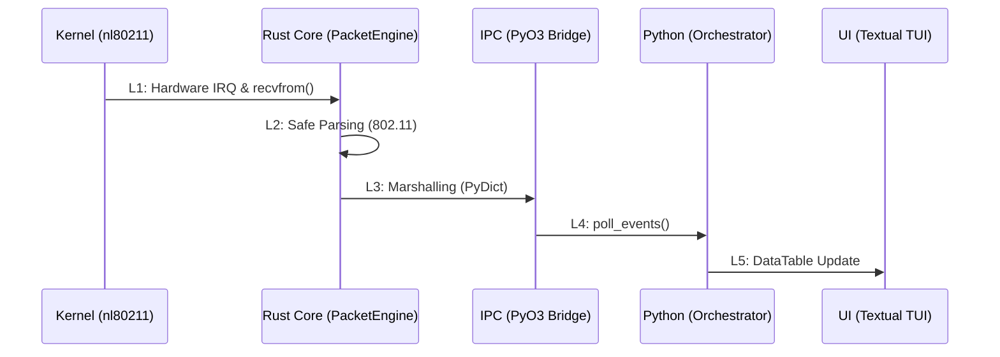

# Lifecycle of a Packet: From Antenna to TUI

Понимание жизненного цикла пакета в SORA критично для оценки производительности и обеспечения целостности данных. Этот раздел описывает путь одного кадра 802.11 через все слои системы.

## 1. Сквозная трассировка (L1-L5)

### L1: Ядро и Захват (Kernel ➔ Rust)
- **Механизм**: Драйвер Wi-Fi адаптера (например, `ath9k`) получает физический сигнал, преобразует его в `sk_buff` и передает в сетевой стек Linux.
- **Интерфейс**: SORA открывает RAW-сокет типа `AF_PACKET`. Вызов `libc::recvfrom` в `RawSocket::recv` (см. `af_packet.rs`) копирует данные из буфера ядра в пользовательское пространство Rust.
- **Latency**: ~15–50 мкс.

### L2: Безопасный Парсинг (Internal Rust)
- **Механизм**: Слайс байтов `&[u8]` передается в `parse_frame`.
- **Safety Choice**: В отличие от драйверов на C, SORA использует **Safe Rust** для разбора Information Elements (IE). Проверки границ (Bounds Checking) встроены в язык, что исключает ошибки типа `Buffer Overflow` при обработке специально сформированных (malformed) кадров.
- **Latency**: ~2–8 мкс.

### L3: Пересечение Границы (IPC Marshalling)
- **Механизм**: Нативная структура `SoraEvent` конвертируется в `PyDict` через PyO3.
- **Data Flow**: Данные помещаются в `crossbeam-channel` (MPSC). Этот этап требует захвата **GIL** (Global Interpreter Lock) на доли микросекунд.
- **Latency**: ~150–300 мкс.

### L4: Оркестрация (Python Logic)
- **Механизм**: Основной цикл асинхронного приложения вызывает `event_receiver.poll_events()`.
- **Processing**: `AttackController` анализирует тип события, обновляет состояние FSM и, при необходимости, инициирует запись в SQLite.

### L5: Визуализация (TUI Render)
- **Механизм**: Метод `update_cell` виджета `DataTable` изменяет состояние ячейки в памяти Textual.
- **Sync**: Асинхронный движок отрисовки сбрасывает изменения на терминал пользователя при следующей итерации цикла событий.
- **Latency**: ~5–30 мс (зависит от частоты опроса TUI).

## 2. Анализ задержек (Latency Bottlenecks)

| Этап | Тип нагрузки | Риск |
| :--- | :--- | :--- |
| **L1 ➔ L2** | CPU / Kernel | Переполнение `rmem_max` при высоком PPS. |
| **L3 ➔ L4** | IPC / GIL | Задержка из-за блокировок Python при тяжелых вычислениях или записи в БД. |
| **L4 ➔ L5** | I/O / Terminal | Лаги терминала при попытке отрисовать 1000+ строк одновременно. |

:::info
**Strict Technical Note**: Основное преимущество архитектуры SORA в том, что **L1** и **L2** работают в нативном потоке, защищенном от пауз в Python-слое. Даже если UI "завис" на 500мс, захват пакетов и запись в PCAP продолжаются без потерь.
:::
