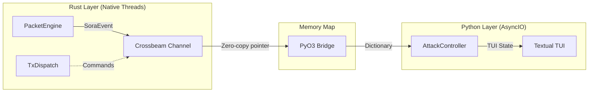

# IPC Architecture: Rust ➔ Python Bridge

Система межпроцессного взаимодействия (IPC) в SORA спроектирована для обеспечения максимальной пропускной способности при передаче тысяч событий в секунду из нативного ядра в интерпретатор Python.

## 1. Механизм кольцевого буфера (MPSC)

SORA использует библиотеку `crossbeam-channel` для создания многопоточной очереди сообщений.

### Технические детали:
- **Тип канала**: `mpsc` (Multi-Producer, Single-Consumer).
- **Backpressure**: Если очередь Python переполнена, Rust-ядро начинает отбрасывать неприоритетные события (Beacon) для сохранения стабильности системы.
- **Priority Queue**: События `eapol_captured` и `adapter_error` имеют высший приоритет и доставляются мгновенно.

## 2. Сериализация PyO3

Передача данных в Python происходит через механизм `PyDict`.
1. **Rust**: Объект `SoraEvent` конвертируется в ассоциативный массив.
2. **Python**: Поток забирает объект, который уже является валидным словарем Python, что исключает стадию `json.loads` и экономит CPU.
