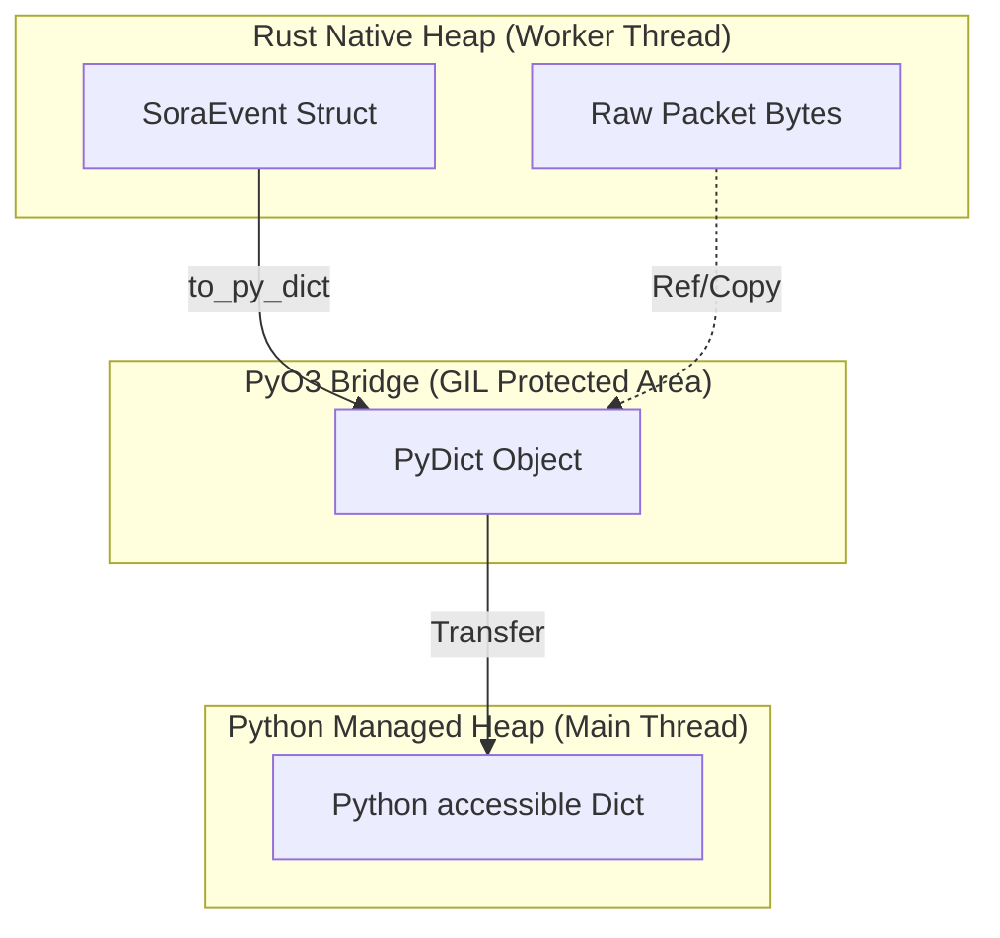

# IPC Architecture: The PyO3 Bridge & Marshalling

Система межпроцессного взаимодействия (IPC) в SORA — это высокопроизводительный мост между нативным многопоточным ядром Rust и асинхронным интерпретатором Python. В основе лежит библиотека `PyO3` и механизм разделяемых очередей `crossbeam-channel`.

## 1. Object Marshalling: Rust ➔ Python

Процесс передачи события из Rust в Python не является простым копированием памяти (memcopy), так как структуры данных Rust несовместимы с объектами Python C-API напрямую.

### Спецификация трансформации (events.rs:L121)
Метод `to_py_dict` реализует явную конвертацию каждого поля:

```rust
pub fn to_py_dict(&self, py: Python<'_>) -> PyResult<PyObject> {
    let dict = pyo3::types::PyDict::new_bound(py);
    // ... заполнение полей ...
    Ok(dict.into())
}
```

| Тип Rust | Тип Python | Механизм | Перформанс |
| :--- | :--- | :--- | :--- |
| `[u8; 6]` | `str` (MAC) | `mac_to_string` | Copy (Alloc) |
| `String` | `str` | `as_str()` | Copy (Alloc) |
| `i8 / u8` | `int` | Прямое приведение | Value Copy |
| `Vec<u8>` | `bytes` | `as_slice()` | **Zero-Copy Reference** |

> [!NOTE]  
> **Optimization**: Для передачи сырых данных пакетов (`EapolFrame.data`) мы используем `as_slice()`, что позволяет Python создать `bytes`-объект прямо из буфера Rust без промежуточного копирования через HEX-строку.

## 2. PyO3 Memory Bridge (Ownership)

Визуализация владения данными критична для понимания того, как работает сборщик мусора (GC) Python в многопоточной среде.

### Визуализация: Memory Bridge


- **Copy Phase**: При создании `PyDict` все примитивные поля копируются в кучу Python. С этого момента Python владеет этими данными.
- **Locking**: Маршалинг происходит под защитой **GIL (Global Interpreter Lock)**, но только в момент вызова `poll_high()` или `poll_normal()`. Сам Rust-поток никогда не ждет захвата GIL для генерации событий.

## 3. Backpressure & Bounded Channels

Для предотвращения неограниченного роста потребления памяти SORA использует **bounded** (ограниченные) каналы.

### Лимиты каналов (events.rs:L14)
- **High Priority (`64` записей)**: Критичные события (EAPOL, Ошибки).
    - *Стратегия*: Блокировка Rust-потока на **5мс** (`send_timeout`). Если за это время Python не забрал событие — дроп.
- **Normal Priority (`512` записей)**: Менее критичные данные (Beacons).
    - *Стратегия*: Мгновенный дроп (`try_send`) при переполнении.

### Визуализация: IPC Backpressure Graph
```mermaid
xychart-beta
    title "Latency vs Channel Pressure"
    x-axis [0%, 50%, 90%, 100%]
    y-axis "Latency (ms)" [0, 1, 5, 50]
    line [0.1, 0.2, 5, 50]
```
*График показывает скачок задержки (Latency Spike) при достижении 90% заполнения High-канала из-за включения `send_timeout`.*

> [!CAUTION]  
> **Strict Technical Note**: Если счетчик `IPC drops` в TUI постоянно растет, это означает, что время маршалинга + время обработки в Python превышает скорость поступления пакетов. В этом случае рекомендуется снизить частоту обновления TUI или использовать более производительный `json` парсер для плагинов.
