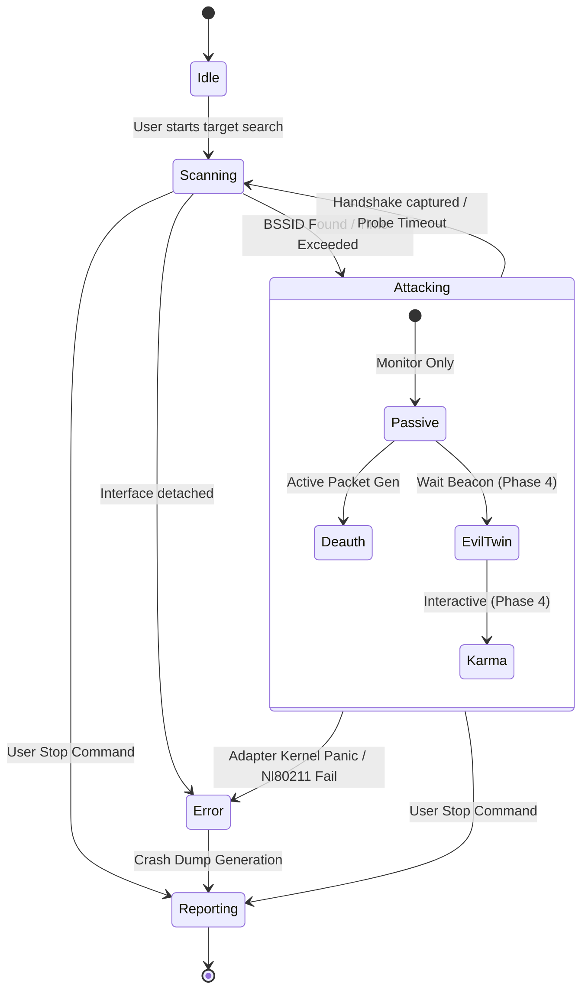

# Машина Состояний (AttackController FSM)

Машинное состояние (FSM) в `AttackController` — это единственный легальный способ перехода между этапами работы (сканирование, захват хэндшейков, симуляция Evil Twin).

Использование строгой FSM гарантирует, что при критической ошибке драйвера адаптера (или, например, отсоединении антенны) система не оставит висящие процессы `hostapd` и зависшие Netlink блокировки.

## Граф Переходов (State Machine Flow)

В SORA 4 состояния, между которыми двигается оркестратор. Состояние `Attacking` в Phase 4 (Advanced Auditing Engines) делится на подсостояния.

> [!CAUTION]  
> **Strict Compliance Statement (Cleanup Protocol):**  
> При любом переходе в состояние `Reporting` или возникновении `Error`, Python-цикл выполняет так называемую Graceful Cleanup (событие `TearDown`). Уничтожаются все запущенные `subprocess.Popen` от `hostapd`, отзывается `AAL::unlock_channel()`, а `iptables` сбрасывается (`-D` правила). Это критически важно, чтобы после аудита чужой или своей инфраструктуры она не осталась в скомпрометированном неработоспособном состоянии.

## Переходы Фазы 4

Особый интерес представляет ветка `EvilTwin`. Когда вызывается атака `Attacking::EvilTwin`, физически происходит следующее:

1. **`evil_twin_waiting`**: Python переводит FSM в режим ожидания. Rust `BeaconCloner` начинает свою работу на заданном канале.
2. `hostapd` и `dnsmasq` в этот момент **МОЛЧАТ**. Это железное правило архитектуры v4.4 — мы не запускаем злого двойника вслепую (вдруг оригинал не работает?).
3. **`evil_twin_ready`**: Событие пробрасывается через `IPC High-Priority Channel` в Python. Оно содержит полный слепок Information Elements (IE).
4. **Конфигурация**: FSM дергает `ConfigManager`, генерирует точный `hostapd.conf` и спавнит демоны. Двойник оживает.

## Логика таймаутов

В FSM встроена система таймаутов:
- Если цель не обнаружена в `Scanning` за заданное время — возврат в `Idle`.
- Если запущен `EvilTwin`, но событие `evil_twin_ready` не поступило в течение `waiting_timeout_ms` — FSM форсировано кидает исключение `adapter_error` и уходит в `Error` для сброса состояния (Fallback).
