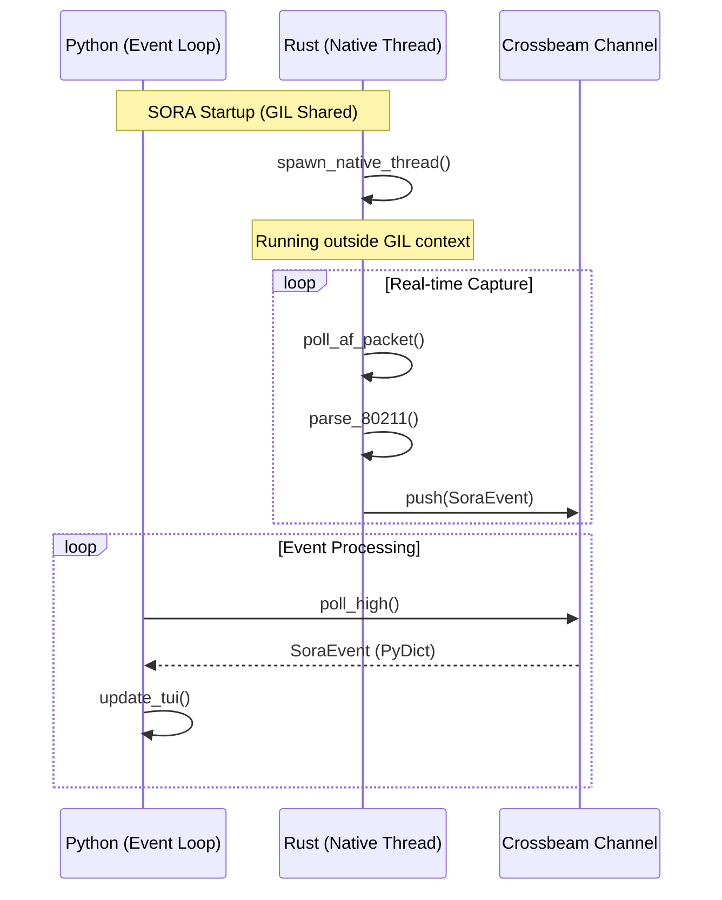
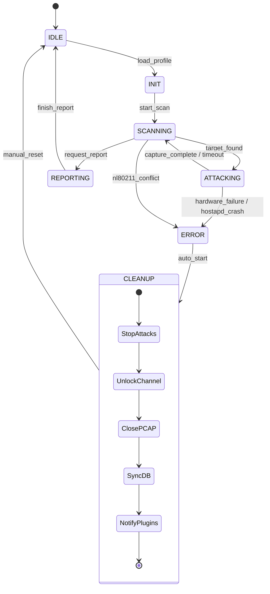

# AttackController & The GIL Escape

Этот раздел документирует высокоуровневую логику управления SORA и архитектурное решение по обходу ограничений Global Interpreter Lock (GIL) в Python.

## 1. Архитектура "The GIL Escape"

Одной из главных проблем при разработке производительных инструментов на Python является GIL, который не позволяет выполнять байт-код Python параллельно в нескольких системных потоках. SORA решает эту проблему путем выноса всей "тяжелой" работы в нативное Rust-ядро.

### Визуализация: GIL Escape

### Визуализация: State Machine (Extended)

### Разделение обязанностей:
- **Python (Orchestrator)**: Занимается логикой состояний, обновлением TUI, записью в SQLite и управлением плагинами. Работает в одном потоке в рамках `asyncio` Event Loop.
- **Rust (Worker)**: Занимается захватом пакетов, парсингом 802.11 в реальном времени и инъекцией. Работает в **отдельном нативном системном потоке** (`std::thread`), созданном через PyO3.

### Механизм взаимодействия:
Rust-поток `sora-packet-engine` полностью независим от интерпретатора Python. Он пишет события в MPSC-канал (Crossbeam). Python-слой вызывает метод `poll()`, который лишь проверяет наличие готовых объектов в очереди. Это позволяет SORA обрабатывать тысячи пакетов в секунду на Rust-стороне, пока Python-интерфейс остается отзывчивым.

> [!TIP]  
> **Performance Note**: Благодаря такой архитектуре, нагрузка на CPU со стороны Python-процесса минимальна (~2-5%), в то время как Rust-поток может утилизировать 100% ядра для решения задач захвата без блокировки UI.

## 2. Управление задачами AsyncIO

`AttackController` интегрирован с `asyncio` для управления фоновыми операциями.

### Жизненный цикл событий (fsm.py:L51)
Метод `process_event` вызывается из основного цикла `run_tui`. 
1. **Polling**: `asyncio` периодически проверяет `rx.poll_high()`.
2. **Dispatch**: Если событие найдено, оно передается в `AttackController`.
3. **State Change**: Если событие критическое (например, завершение хэндшейка), контроллер вызывает `_transition()`.

### Graceful Cleanup (fsm.py:L159)
При переходе в состояние `ERROR` или завершении сессии, контроллер запускает протокол очистки. Это гарантирует, что система не останется в нестабильном состоянии.
- **Timeout**: На очистку отводится строго **3.0 секунды**.
- **Последовательность**:
    1. Остановка генераторов пакетов в Rust.
    2. Снятие аппаратных блокировок (Channel Unlock).
    3. Синхронизация и закрытие PCAP-файла.
    4. Фиксация состояния в базе данных MetadataDB.
    5. Уведомление внешних плагинов через Plugin Bus.

## 3. Таблица состояний и переходов

| Состояние | Описание | Допустимые переходы |
| :--- | :--- | :--- |
| **IDLE** | Ожидание команды пользователя | `SCANNING` |
| **SCANNING** | Активный поиск целевой сети и сбор Beacon | `ATTACKING`, `REPORTING`, `ERROR` |
| **ATTACKING** | Выполнение активных/пассивных атак | `SCANNING`, `REPORTING`, `ERROR` |
| **REPORTING** | Генерация финального отчета | `IDLE` |
| **ERROR** | Критическая ошибка (Hardware/Driver) | `IDLE` (после Reset) |

## 3. Отказоустойчивость (Fault Tolerance)

SORA спроектирована по принципу предотвращения "подвешенного" состояния системы.

### Обработка падения `hostapd`
Если процесс `hostapd`, запущенный `ConfigManager`, завершается аварийно:
1. Плагин/Менеджер детектирует завершение по PID-файлу или `SIGCHLD`.
2. В шину IPC отправляется событие `adapter_error`.
3. `AttackController` немедленно вызывает `enter_error("hostapd_failure")`.
4. Запускается **CLEANUP**, который гарантированно освобождает интерфейс.

### Обработка переполнения IPC очереди
Если Python-слой лагает (например, тяжелый парсинг SQLite) и очередь `crossbeam` переполняется:
- **Rust Side**: Выбрасывает старые `BeaconFrame` события, но сохраняет `EapolFrame` в буфере на 5мс.
- **Python Side**: `StatusPanel` в TUI отображает рост `IPC drops`. Это сигнал оператору о необходимости оптимизации дисковой подсистемы.

> [!CAUTION]  
> **Strict Technical Note**: При переходе в состояние `ERROR` на очистку отводится строго **3.0 секунды**. Если по какой-то причине очистка не завершилась, SORA выполняет форсированный выход (`sys.exit`), полагаясь на автоматический Cleanup ядра Linux для открытых PCAP-файлов и raw-сокетов.
