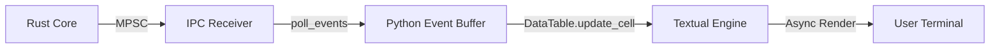

# TUI Internals: Textual & Event Loop Optimization

Интерфейс SORA построен на базе фреймворка `Textual` (Async TUI). Основная задача этого слоя — визуализация высокоскоростного потока событий из Rust-ядра без блокировки основного цикла отрисовки.

## 1. Textual Event Loop & Polling

Поскольку Rust-ядро работает в нативном системном потоке, Python-слой должен периодически запрашивать новые данные. Для этого используется таймер `set_interval`.

### Механизм опроса (app.py:L83)
```python
# Интервал 50мс (20 FPS для обновлений сети)
self.set_interval(0.05, self.poll_events)
```

Каждые 50 мс вызывается метод `poll_events`, который выполняет "дренирование" (draining) каналов IPC:
1. **Normal Queue (Beacons)**: Читаются все накопившиеся маяки точек доступа.
2. **High Priority Queue (EAPOL)**: Читаются критические события захвата хэндшейков.
3. **Internal Log**: Вывод строковых логов в правую панель.

## 2. Оптимизация DataTable

Для отображения сотен точек доступа используется виджет `DataTable`. При большой активности в радиоэфире стандартная вставка строк может привести к лагам интерфейса.

### Стратегия O(1) обновлений (app.py:L58)
SORA использует хеш-карту `self.networks` (BSSID ➔ RowKey) для кэширования ссылок на строки таблицы.

```python
if bssid not in self.networks:
    # O(1) за запуск сессии для каждого BSSID
    row_key = table.add_row(bssid, ssid, ch, rssi, "")
    self.networks[bssid] = row_key
else:
    # Мгновенное обновление ячейки без перерисовки всей таблицы
    table.update_cell(self.networks[bssid], "RSSI", rssi)
```

**Преимущества:**
- **Инкрементальность**: Если уровень сигнала (RSSI) изменился у 10 AP одновременно, перерисовываются только конкретные ячейки.
- **Memory Efficiency**: Мы не храним копии данных фреймов в UI-слое, только ссылки на ключи строк.

## 3. Визуализация: TUI Rendering Pipeline



## 4. Обработка IPC Drops (Backpressure)

В панели статуса (внизу) отображается счетчик `IPC drops` (app.py:L143).
- **Источник**: Rust-ядро считает пакеты, которые не влезли в `ArrayQueue` (4096 записей).
- **Диагностика**: Если счетчик растет при 20 FPS опросе в TUI, значит Python-слой не успевает обрабатывать входящий трафик (например, из-за медленной записи в SQLite).

> [!WARNING]  
> **Strict Technical Note**: При превышении 1000 дропов в секунду TUI может временно "заморозить" обновление Beacon-таблицы, чтобы приоритезировать обработку EAPOL-событий.
