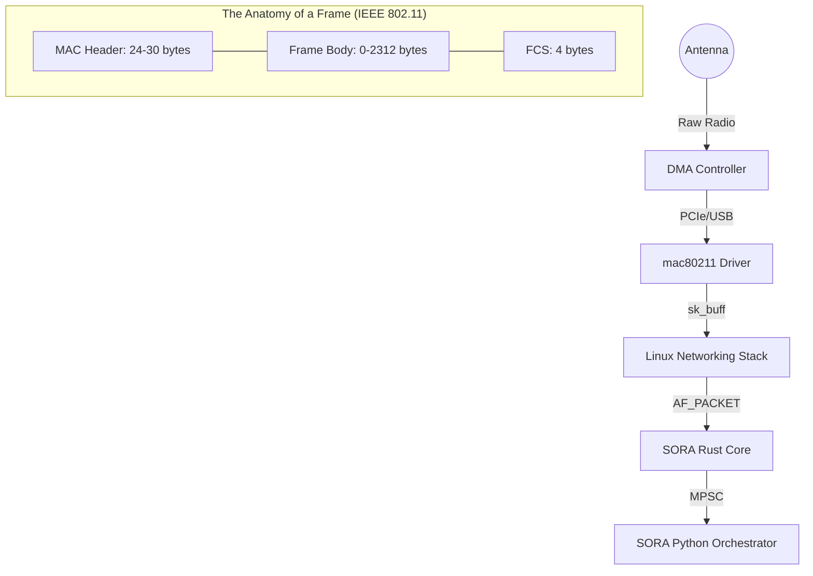

# PacketEngine & AF_PACKET Deep Dive

Этот раздел описывает низкоуровневую реализацию захвата и инъекции пакетов в SORA. Архитектура ориентирована на минимальные задержки (low-latency) и прямое взаимодействие с сетевым стеком ядра Linux через семейство сокетов `AF_PACKET`.

## 1. Zero-Copy Philosophy

В SORA минимизация копирования данных между адресными пространствами является приоритетом. 

### Визуализация: Hardware Path & Frame Anatomy


### Механизм передачи данных:
1. **Ядро ➔ Драйвер**: Пакеты поступают в кольцевой буфер (Ring Buffer) сетевой карты.
2. **Драйвер ➔ PacketEngine**: Вызов `libc::recv` копирует данные из буфера ядра в предварительно аллоцированный стек-буфер `buf: [u8; 4096]` (см. `packet_engine.rs:L76`).
3. **PacketEngine ➔ Parser**: Парсинг выполняется над срезом (slice) этого же буфера без аллокаций в куче.
4. **Parser ➔ SoraEvent**: Если фрейм релевантен (например, EAPOL), создается `SoraEvent`. Поле `data: Vec<u8>` — это единственное место, где происходит аллокация в куче для передачи владения данными в Python-слой.

:::info
В Phase 4 планируется внедрение `PACKET_RX_RING` (mmap), что позволит полностью исключить копирование `recv` и читать пакеты напрямую из разделяемой памяти между ядром и SORA.
:::

## 2. AF_PACKET: Низкоуровневая реализация

SORA взаимодействует с сетевым стеком через интерфейс `libc`. Использование `AF_PACKET` позволяет обходить уровень протоколов L3/L4.

### Инициализация сокета (af_packet.rs:L30)

Функция `RawSocket::new` выполняет следующие шаги:

1. **Создание дескриптора**:
   ```rust
   libc::socket(AF_PACKET, SOCK_RAW, ETH_P_ALL.to_be())
   ```
   Флаг `ETH_P_ALL` указывает ядру передавать нам **все** Ethernet-фреймы (включая Radiotap, если интерфейс в Monitor Mode).

2. **Маппинг интерфейса**:
   Вызов `libc::if_nametoindex` преобразует имя (например, `wlan0mon`) в целочисленный индекс `ifindex`, необходимый ядру.

3. **Связывание (Binding)**:
   Используется структура `libc::sockaddr_ll` (Link Layer address).
   ```rust
   struct sockaddr_ll {
       sll_family:   u16,     // AF_PACKET
       sll_protocol: u16,     // ETH_P_ALL
       sll_ifindex:  i32,     // Индекс интерфейса
       sll_hatype:   u16,     // Тип заголовка (ARPHRD_IEEE80211)
       sll_pkttype:  u8,      // Тип пакета (PACKET_OTHERHOST)
       sll_halen:    u8,      // Длина адреса
       sll_addr:     [u8; 8], // Физический адрес
   };
   ```
   SORA заполняет `sll_ifindex` и `sll_protocol`, вызывая `libc::bind`. Это гарантирует, что сокет привязан только к целевому адаптеру.

## 3. Спецификация 802.11 Parsing (IEEE 802.11-2020)

Парсинг в `parsers.rs` опирается на фиксированные смещения стандарта. SORA предполагает наличие Radiotap-заголовка (обычно 24-36 байт, определяется динамически).

### Смещения MAC-заголовка (от начала 802.11 фрейма)

| Смещение (байт) | Длина | Поле | Стандарт | Описание |
| :--- | :--- | :--- | :--- | :--- |
| **0** | 2 | **Frame Control** | §9.2.4.1 | Тип, подтип и флаги фрейма |
| **2** | 2 | **Duration/ID** | §9.2.4.2 | Время занятия среды |
| **4** | 6 | **Address 1** | §9.2.4.3 | RA (Receiver Address) |
| **10** | 6 | **Address 2** | §9.2.4.3 | TA (Transmitter Address) |
| **16** | 6 | **Address 3** | §9.2.4.3 | BSSID |
| **22** | 2 | **Sequence Control** | §9.2.4.4 | Номер фрагмента и последовательности |

### Разбор Frame Control Field (16 бит)

```text
Bits:  0-1    2-3      4-7    8    9    10   11   12   13   14   15
Field: Ver  Type    Subtype  ToDS FrDS More Frag Retry Pwr  More Prot Order
```

**Логика SORA:**
- `Type == 00` (Management) + `Subtype == 1000` (Beacon) ➔ `ParsedFrame::Beacon`.
- `Type == 10` (Data) + `Subtype == 0000` (Data) + наличие LLC/SNAP ➔ проверка на EAPOL (Type 0x888E).

## 4. Инъекция пакетов (TX Path)

Вызов `RawSocket::send` (см. `af_packet.rs:L85`) является прямой оберткой над системным вызовом `libc::send`. 
1. Пакет не проходит через таблицу маршрутизации.
2. Пакет не фрагментируется ядром.
3. Драйвер добавляет FCS (Frame Check Sequence) автоматически, если не указано иное через `IEEE80211_TX_CTL_NO_FCS`.

:::info
Операция инъекции синхронна. Для соблюдения таймингов Phase 4 (Karma) используется `crossbeam` канал с приоритетом, чтобы `TxDispatch` поток не блокировал логику `PacketEngine`.
:::
