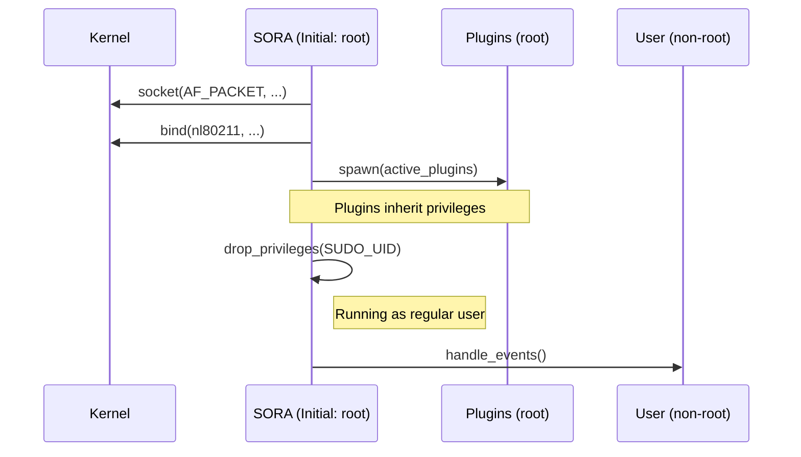

# Модель Безопасности и Memory Safety

Проект SORA оперирует на низком уровне сетевого стека Linux, что требует особого внимания к управлению привилегиями и безопасности памяти. Этот раздел документирует Threat Model и аудит `unsafe` кода.

## 1. Модель Угроз и Привилегии

Для работы с `AF_PACKET` и `nl80211` процессу требуются расширенные привилегии. 

### Необходимые Capabilities (Linux)
SORA требует следующие возможности ядра:
- **`CAP_NET_RAW`**: Для открытия сырых сокетов и инъекции произвольных фреймов.
- **`CAP_NET_ADMIN`**: Для изменения параметров интерфейса (Monitor Mode, Change Channel).

### Процесс Privilege Drop (priv_drop.rs)
Для минимизации поверхности атаки SORA следует принципу **Least Privilege**. Основной цикл оркестратора не работает под пользователем `root`.

### Этапы инициализации:
1. **Phase 1 (Initialize)**: Процесс запускается под `root` или с установленными capabilities.
2. **Phase 2 (Open FD)**: Ядро Rust открывает все необходимые дескрипторы файлов (raw sockets, netlink).
3. **Phase 3 (Spawn Plugins)**: Плагины запускаются до сброса прав, чтобы унаследовать необходимые полномочия для работы с `iptables`.
4. **Phase 4 (Drop)**: Вызов `drop_privileges`.
5. **Phase 5 (Verify)**: Проверка через `getuid() != 0`.

## 2. Аудит `unsafe` блоков (Safety Rationale)

Использование `unsafe` в Rust-ядре SORA ограничено исключительно вызовами `libc` и FFI, где невозможно использование безопасных оберток без потери производительности или гибкости.

### Модуль `engine/af_packet.rs`
- **`libc::if_nametoindex`**: Используется для получения индекса интерфейса. Безопасно, так как входная строка проверяется на валидность.
- **`libc::bind` / `libc::recv` / `libc::send`**: Прямые вызовы системных функций. SORA гарантирует, что передаваемые буферы (`buf.as_mut_ptr()`) имеют достаточный размер и не перекрываются.
- **`std::mem::zeroed`**: Используется для инициализации `sockaddr_ll`. Безопасно, так как структура состоит из примитивных типов и корректно заполняется перед использованием.

### Модуль `nl80211/neli_backend.rs`
- **`libc::ioctl`**: Используется для `SIOCSIFFLAGS` (UP/DOWN).
  - *Rationale*: Структура `ifreq` подготавливается через `ptr::copy_nonoverlapping`. Мы ограничиваем копирование длиной `IFNAMSIZ - 1`, чтобы предотвратить переполнение буфера в стеке.

## 3. Защита от переполнения (Buffer Management)

SORA не использует динамическую аллокацию строк или векторов внутри критического пути `recv -> parse`. 
- Все парсеры в `parsers.rs` работают со срезами (`&[u8]`).
- Проверки границ (bounds check) выполняются Rust-компилятором автоматически.
- `SoraEvent` сериализуется в Python-объекты через PyO3, которая обеспечивает безопасное копирование данных в кучу Python.

> [!IMPORTANT]  
> **Security Audit Note**: Основной вектор атаки на SORA — это специально сформированные 802.11 фреймы, вызывающие логические ошибки в парсере. Благодаря Rust, такие фреймы могут привести к `panic!`, но не к произвольному исполнению кода (RCE).
