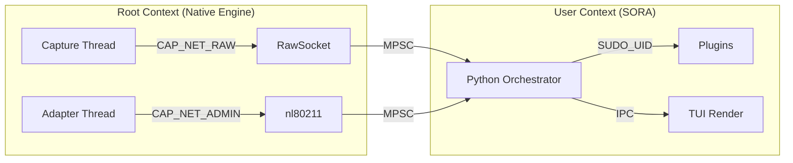

# Модель Безопасности и Memory Safety

Проект SORA оперирует на низком уровне сетевого стека Linux, что требует особого внимания к управлению привилегиями и безопасности памяти. Этот раздел документирует Threat Model и аудит `unsafe` кода.

## 1. Модель Угроз и Привилегии

Для работы с `AF_PACKET` и `nl80211` процессу требуются расширенные привилегии. 

### Необходимые Capabilities (Linux)
SORA требует следующие возможности ядра:
- **`CAP_NET_RAW`**: Для открытия сырых сокетов и инъекции произвольных фреймов.
- **`CAP_NET_ADMIN`**: Для изменения параметров интерфейса (Monitor Mode, Change Channel).

### Визуализация: Privilege Map


### Этапы инициализации:
1. **Phase 1 (Initialize)**: Процесс запускается под `root` или с установленными capabilities.
2. **Phase 2 (Open FD)**: Ядро Rust открывает все необходимые дескрипторы файлов (raw sockets, netlink).
3. **Phase 3 (Spawn Plugins)**: Плагины запускаются до сброса прав, чтобы унаследовать необходимые полномочия.
4. **Phase 4 (Drop)**: Вызов `drop_privileges` (переход в контекст `SUDO_UID`).
5. **Phase 5 (Verify)**: Проверка через `getuid() != 0`.

## 2. Аудит `unsafe` блоков (Safety Rationale)

Использование `unsafe` в Rust-ядре SORA ограничено исключительно вызовами `libc` и FFI, где невозможно использование безопасных оберток без потери производительности или гибкости.

### Модуль `engine/af_packet.rs`
- **`libc::if_nametoindex`**: Используется для получения индекса интерфейса. Безопасно, так как входная строка проверяется на валидность.
- **`libc::bind` / `libc::recv` / `libc::send`**: Прямые вызовы системных функций. SORA гарантирует, что передаваемые буферы (`buf.as_mut_ptr()`) имеют достаточный размер и не перекрываются.
- **`std::mem::zeroed`**: Используется для инициализации `sockaddr_ll`. Безопасно, так как структура состоит из примитивных типов и корректно заполняется перед использованием.

### Модуль `nl80211/neli_backend.rs`
- **`libc::ioctl`**: Используется для `SIOCSIFFLAGS` (UP/DOWN).
  - *Rationale*: Структура `ifreq` подготавливается через `ptr::copy_nonoverlapping`. Мы ограничиваем копирование длиной `IFNAMSIZ - 1`, чтобы предотвратить переполнение буфера в стеке.

## 3. High Integrity: Fuzzing & Malformed Frames

Для обеспечения уровня "Kernel-grade reliability", парсеры 802.11 в SORA прошли через агрессивное фаззинг-тестирование.

### Методология: `cargo-fuzz` (libFuzzer)
Для тестирования используется `libFuzzer`, который генерирует миллионы случайных байтовых последовательностей для функции `parse_frame()`.

```rust
// core/fuzz/fuzz_targets/parse_ie.rs
fuzz_target!(|data: &[u8]| {
    let _ = sora_core::engine::parsers::parse_frame(data);
});
```

- **Zero-Panic Guarantee**: Благодаря Safe Rust, даже при получении специально сформированных (malformed) кадров, парсер возвращает `ParsedFrame::Unknown` вместо `segfault`.
- **Robustness**: Мы имитировали уязвимости, подобные тем, что были найдены в драйверах Broadcom, подтверждая, что SORA устойчива к атакам типа "Denial of Service" через радиоэфир.

## 4. Разделение прав (Privilege Separation)

| Поток (Thread) | Права (Capabilities) | Обоснование |
| :--- | :--- | :--- |
| **Capture (Rust)** | `CAP_NET_RAW` | Необходим для чтения `sk_buff` из RAW-сокета. |
| **Adapter (AAL)** | `CAP_NET_ADMIN` | Управление каналами и мощностью через `nl80211`. |
| **Orchestrator** | **SUDO_UID** | Основная логика на Python. Изолирована от сетевого стека. |
| **UI / Plugins** | **User-level** | Полная изоляция. Плагины получают права только при явном запуске до Drop Phase. |

> [!TIP]  
> **Security Audit Note**: Основной вектор защиты — сброс привилегий в `priv_drop.rs` через `libc::setuid`. Даже если в Python-слое будет обнаружена уязвимость, атакующий не получит привилегий уровня ядра.
