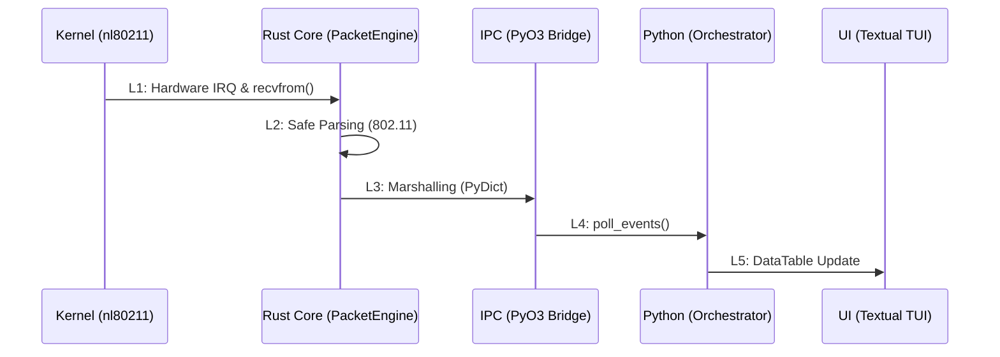

# Lifecycle of a Packet: From Antenna to TUI

Understanding the lifecycle of a packet in SORA is critical for performance evaluation and data integrity assurance. This section describes the journey of a single 802.11 frame through all layers of the system.

## 1. End-to-End Tracing (L1-L5)

### L1: Kernel and Capture (Kernel ➔ Rust)
- **Mechanism**: The Wi-Fi adapter driver (e.g., `ath9k`) receives a physical signal, converts it into an `sk_buff`, and passes it to the Linux network stack.
- **Interface**: SORA opens a `RAW` socket of type `AF_PACKET`. The `libc::recvfrom` call in `RawSocket::recv` (see `af_packet.rs`) copies the data from the kernel buffer into Rust's user space.
- **Latency**: ~15–50 µs.

### L2: Safe Parsing (Internal Rust)
- **Mechanism**: The byte slice `&[u8]` is passed to `parse_frame`.
- **Safety Choice**: Unlike C-based drivers, SORA uses **Safe Rust** to parse Information Elements (IE). Bounds checking is built into the language, eliminating `Buffer Overflow` vulnerabilities when processing malformed frames.
- **Latency**: ~2–8 µs.

### L3: Boundary Crossing (IPC Marshalling)
- **Mechanism**: The native `SoraEvent` structure is converted to a `PyDict` via PyO3.
- **Data Flow**: Data is placed in a `crossbeam-channel` (MPSC). This stage requires acquiring the **GIL** (Global Interpreter Lock) for fractions of a microsecond.
- **Latency**: ~150–300 µs.

### L4: Orchestration (Python Logic)
- **Mechanism**: The main loop of the asynchronous application calls `event_receiver.poll_events()`.
- **Processing**: The `AttackController` analyzes the event type, updates the FSM state, and, if necessary, initiates an entry in SQLite.

### L5: Visualization (TUI Render)
- **Mechanism**: The `update_cell` method of the `DataTable` widget modifies the cell's state in Textual's memory.
- **Sync**: The asynchronous rendering engine flushes changes to the user's terminal during the next event loop iteration.
- **Latency**: ~5–30 ms (depends on TUI polling frequency).

## 2. Latency Bottlenecks Analysis

| Stage | Load Type | Risk |
| :--- | :--- | :--- |
| **L1 ➔ L2** | CPU / Kernel | `rmem_max` overflow at high PPS. |
| **L3 ➔ L4** | IPC / GIL | Delay due to Python locking during heavy computation or DB writing. |
| **L4 ➔ L5** | I/O / Terminal | Terminal lag when attempting to render 1000+ rows simultaneously. |

:::info
**Strict Technical Note**: The main advantage of SORA's architecture is that **L1** and **L2** run in a native thread, shielded from pauses in the Python layer. Even if the UI "freezes" for 500ms, packet capture and PCAP logging continue without loss.
:::
