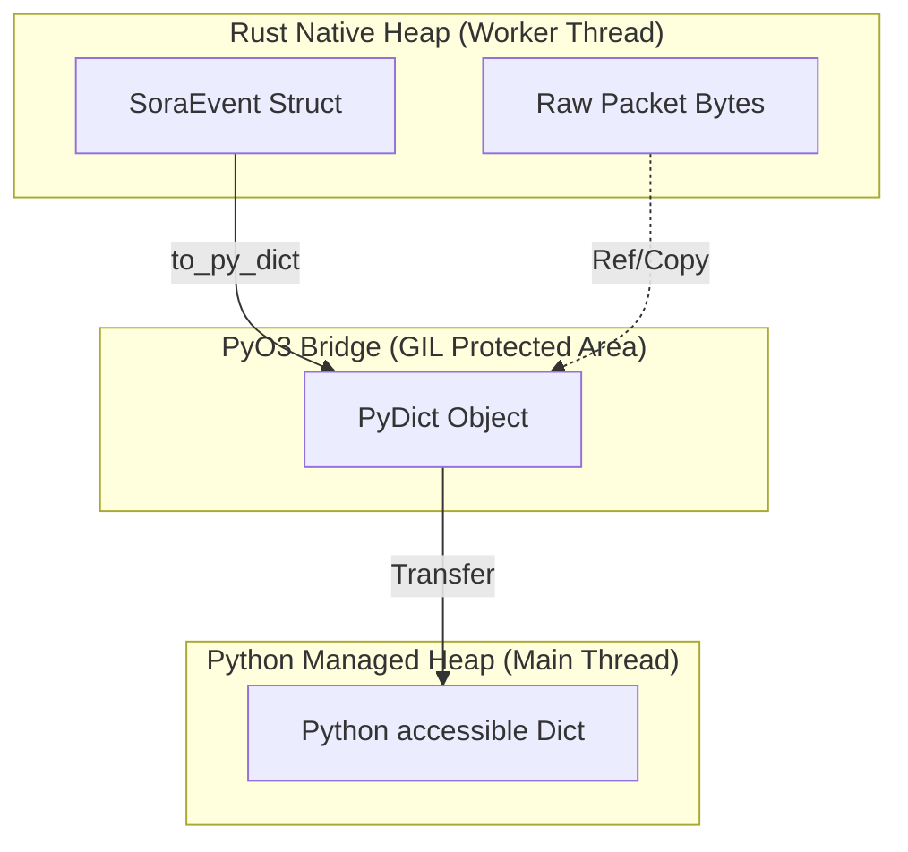

# IPC Architecture: The PyO3 Bridge & Marshalling

The Inter-Process Communication (IPC) system in SORA is a high-performance bridge between the native multi-threaded Rust core and the asynchronous Python interpreter. It is based on the `PyO3` library and the `crossbeam-channel` shared queue mechanism.

## 1. Object Marshalling: Rust ➔ Python

The process of passing an event from Rust to Python is not a simple memory copy (`memcpy`), as Rust data structures are not directly compatible with Python C-API objects.

### Transformation Specification (events.rs:L121)
The `to_py_dict` method implements explicit conversion for each field:

```rust
pub fn to_py_dict(&self, py: Python<'_>) -> PyResult<PyObject> {
    let dict = pyo3::types::PyDict::new_bound(py);
    // ... populating fields ...
    Ok(dict.into())
}
```

| Rust Type | Python Type | Mechanism | Performance |
| :--- | :--- | :--- | :--- |
| `[u8; 6]` | `str` (MAC) | `mac_to_string` | Copy (Alloc) |
| `String` | `str` | `as_str()` | Copy (Alloc) |
| `i8 / u8` | `int` | Direct cast | Value Copy |
| `Vec<u8>` | `bytes` | `as_slice()` | **Zero-Copy Reference** |

:::info
**Optimization**: For transferring raw packet data (`EapolFrame.data`), we use `as_slice()`, allowing Python to create a `bytes` object directly from the Rust buffer without intermediate copying through a HEX string.
:::

## 2. PyO3 Memory Bridge (Ownership)

Visualizing data ownership is critical to understanding how the Python garbage collector (GC) operates in a multi-threaded environment.

### Visualization: Memory Bridge


- **Copy Phase**: When a `PyDict` is created, all primitive fields are copied to the Python heap. From that point on, Python owns this data.
- **Locking**: Marshalling occurs under the protection of the **GIL (Global Interpreter Lock)**, but only during `poll_high()` or `poll_normal()` calls. The Rust thread itself never waits for the GIL to generate events.

## 3. Backpressure & Bounded Channels

To prevent unbounded memory consumption growth, SORA uses **bounded** channels.

### Channel Limits (events.rs:L14)
- **High Priority (`64` entries)**: Critical events (EAPOL, Errors).
    - *Strategy*: Rust thread blocks for **5ms** (`send_timeout`). If Python hasn't consumed the event by then — it is dropped.
- **Normal Priority (`512` entries)**: Less critical data (Beacons).
    - *Strategy*: Instant drop (`try_send`) on overflow.

### Visualization: IPC Backpressure Graph
```mermaid
xychart-beta
    title "Latency vs Channel Pressure"
    x-axis [0%, 50%, 90%, 100%]
    y-axis "Latency (ms)" [0, 1, 5, 50]
    line [0.1, 0.2, 5, 50]
```
*The graph shows a latency spike whenreaching 90% capacity of the High-channel due to the `send_timeout` activation.*

## 4. Benchmarks & Limits (Phase 3 Audit)

For system planning, the maximum performance metrics of the IPC bridge on typical hardware are provided below.

| Platform | Max PPS (Packets Per Second) | RAM Baseline | RAM (1000 clients) |
| :--- | :--- | :--- | :--- |
| **Raspberry Pi 4 (4GB)** | ~8,500 | 45 MB | 110 MB |
| **Orange Pi 5 (RK3588)** | ~14,000 | 45 MB | 105 MB |
| **x86_64 (Core i7-12th)** | **~28,000** | 42 MB | 90 MB |

- **PPS Bottleneck**: The primary limitation is PyO3 marshalling and GIL acquisition during transfer to Python.
- **RAM Bottleneck**: The main memory consumer is the `DataTable` in the TUI and the beacon cache in the `AttackController`.
