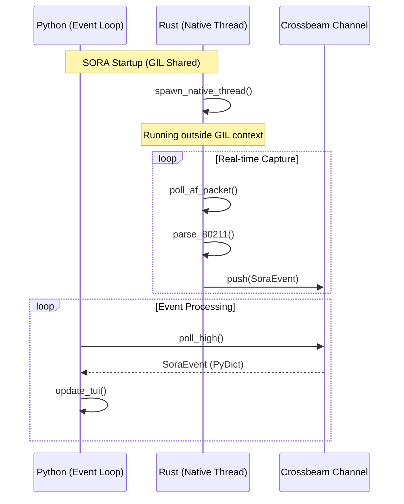
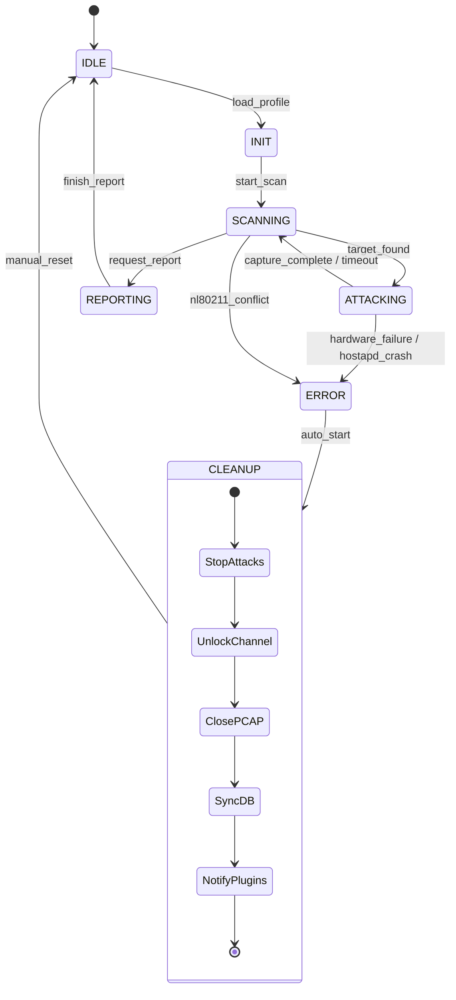

# AttackController & The GIL Escape

This section documents SORA's high-level control logic and the architectural solution used to bypass the limitations of the Python Global Interpreter Lock (GIL).

## 1. "The GIL Escape" Architecture

One of the main challenges when developing high-performance tools in Python is the GIL, which prevents Python bytecode from executing in parallel across multiple system threads. SORA solves this problem by moving all "heavy" work into a native Rust core.

### Visualization: GIL Escape

### Visualization: State Machine (Extended)

### Separation of Duties:
- **Python (Orchestrator)**: Handles state logic, TUI updates, SQLite writing, and plugin management. Runs in a single thread within the `asyncio` Event Loop.
- **Rust (Worker)**: Handles packet capture, real-time 802.11 parsing, and injection. Runs in a **separate native system thread** (`std::thread`) created via PyO3.

### Interaction Mechanism:
The `sora-packet-engine` Rust thread is completely independent of the Python interpreter. It writes events to a MPSC channel (Crossbeam). The Python layer calls the `poll()` method, which merely checks for the presence of ready objects in the queue. This allows SORA to process thousands of packets per second on the Rust side while the Python interface remains responsive.

:::tip
**Performance Note**: Thanks to this architecture, the CPU load on the Python process is minimal (~2-5%), while the Rust thread can utilize 100% of a core for capture tasks without blocking the UI.
:::

## 2. AsyncIO Task Management

The `AttackController` is integrated with `asyncio` to manage background operations.

### Event Lifecycle (fsm.py:L51)
The `process_event` method is called from the main `run_tui` loop.
1. **Polling**: `asyncio` periodically checks `rx.poll_high()`.
2. **Dispatch**: If an event is found, it is passed to the `AttackController`.
3. **State Change**: If the event is critical (e.g., handshake completion), the controller calls `_transition()`.

### Graceful Cleanup (fsm.py:L159)
When transitioning to the `ERROR` state or ending a session, the controller initiates a cleanup protocol. This ensures that the system does not remain in an unstable state.
- **Timeout**: Exactly **3.0 seconds** are allocated for cleanup.
- **Sequence**:
    1. Stop packet generators in Rust.
    2. Release hardware locks (Channel Unlock).
    3. Synchronize and close the PCAP file.
    4. Persist the state in the MetadataDB database.
    5. Notify external plugins via the Plugin Bus.

## 3. States and Transitions Table

| State | Description | Permitted Transitions |
| :--- | :--- | :--- |
| **IDLE** | Waiting for user command | `SCANNING` |
| **SCANNING** | Actively searching for target networks and collecting Beacons | `ATTACKING`, `REPORTING`, `ERROR` |
| **ATTACKING** | Performing active/passive attacks | `SCANNING`, `REPORTING`, `ERROR` |
| **REPORTING** | Final report generation | `IDLE` |
| **ERROR** | Critical error (Hardware/Driver) | `IDLE` (after Reset) |

## 4. Fault Tolerance

SORA is designed to prevent "hung" system states.

### Handling `hostapd` Crashes
If the `hostapd` process launched by `ConfigManager` terminates unexpectedly:
1. The Plugin/Manager detects termination via PID file or `SIGCHLD`.
2. An `adapter_error` event is sent to the IPC bus.
3. The `AttackController` immediately calls `enter_error("hostapd_failure")`.
4. **CLEANUP** is launched, guaranteed to release the interface.

### Handling IPC Queue Overflow
If the Python layer lags (e.g., heavy SQLite parsing) and the `crossbeam` queue overflows:
- **Rust Side**: Drops old `BeaconFrame` events but keeps `EapolFrame` in a 5ms buffer.
- **Python Side**: The `StatusPanel` in the TUI displays the growth of `IPC drops`. This signals the operator that disk subsystem optimization is needed.

:::danger
**Strict Technical Note**: When transitioning to the `ERROR` state, exactly **3.0 seconds** are allocated for cleanup. If for some reason cleanup does not finish, SORA performs a forced exit (`sys.exit`), relying on the Linux kernel's automatic cleanup for open PCAP files and raw sockets.
:::
