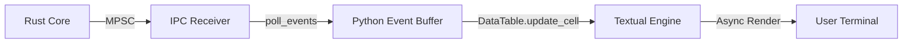

# TUI Internals: Textual & Event Loop Optimization

The SORA interface is built on the `Textual` framework (Async TUI). The main task of this layer is to visualize the high-speed event stream from the Rust core without blocking the main rendering loop.

## 1. Textual Event Loop & Polling

Since the Rust core runs in a native system thread, the Python layer must periodically request new data. For this, a `set_interval` timer is used.

### Polling Mechanism (app.py:L83)
```python
# 50ms interval (20 FPS for network updates)
self.set_interval(0.05, self.poll_events)
```

Every 50 ms, the `poll_events` method is called, which "drains" the IPC channels:
1. **Normal Queue (Beacons)**: Reads all accumulated access point beacons.
2. **High Priority Queue (EAPOL)**: Reads critical handshake capture events.
3. **Internal Log**: Outputs string logs to the right panel.

## 2. DataTable Optimization

The `DataTable` widget is used to display hundreds of access points. With high radio activity, standard row insertion can lead to interface lag.

### O(1) Update Strategy (app.py:L58)
SORA uses a hash map `self.networks` (BSSID ➔ RowKey) to cache references to table rows.

```python
if bssid not in self.networks:
    # O(1) per session start for each BSSID
    row_key = table.add_row(bssid, ssid, ch, rssi, "")
    self.networks[bssid] = row_key
else:
    # Instant cell update without redrawing the entire table
    table.update_cell(self.networks[bssid], "RSSI", rssi)
```

**Advantages:**
- **Incrementality**: If the signal level (RSSI) changes for 10 APs simultaneously, only the specific cells are redrawn.
- **Memory Efficiency**: We do not store copies of frame data in the UI layer, only references to row keys.

## 3. Visualization: TUI Rendering Pipeline



## 4. Handling IPC Drops (Backpressure)

The status panel (at the bottom) displays an `IPC drops` counter (app.py:L143).
- **Source**: The Rust core counts packets that did not fit into the `ArrayQueue` (4096 entries).
- **Diagnosis**: If the counter grows during 20 FPS polling in the TUI, it means the Python layer cannot keep up with processing the incoming traffic (e.g., due to slow SQLite writing).

:::warning
**Strict Technical Note**: If the drop rate exceeds 1000 drops per second, the TUI may temporarily "freeze" updates to the Beacon table to prioritize the processing of EAPOL events.
:::
