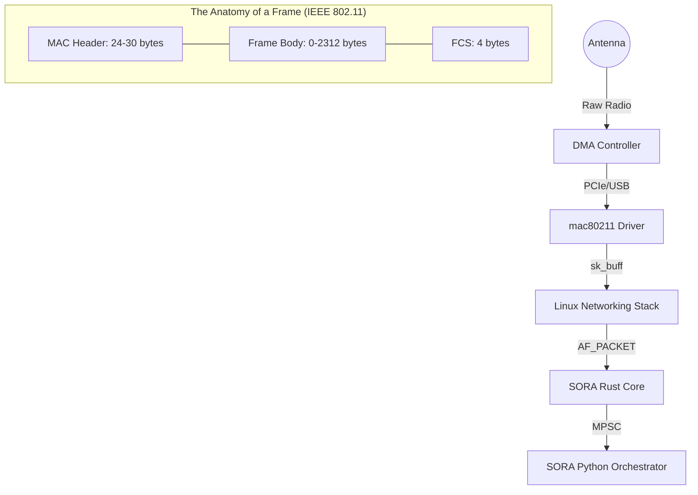

# PacketEngine & AF_PACKET Deep Dive

This section describes the low-level implementation of packet capture and injection in SORA. The architecture is focused on low-latency and direct interaction with the Linux kernel networking stack via the `AF_PACKET` socket family.

## 1. Zero-Copy Philosophy

In SORA, minimizing data copying between address spaces is a priority.

### Visualization: Hardware Path & Frame Anatomy


### Data Transfer Mechanism:
1. **Kernel ➔ Driver**: Packets enter the network card's Ring Buffer.
2. **Driver ➔ PacketEngine**: The `libc::recv` call copies data from the kernel buffer into a pre-allocated stack buffer `buf: [u8; 4096]` (see `packet_engine.rs:L76`).
3. **PacketEngine ➔ Parser**: Parsing is performed on a slice of the same buffer without heap allocations.
4. **Parser ➔ SoraEvent**: If a frame is relevant (e.g., EAPOL), a `SoraEvent` is created. The `data: Vec<u8>` field is the only place where a heap allocation occurs to transfer data ownership to the Python layer.

:::info
In Phase 4, the introduction of `PACKET_RX_RING` (mmap) is planned, which will completely eliminate the `recv` copy and allow reading packets directly from shared memory between the kernel and SORA.
:::

## 2. AF_PACKET: Low-Level Implementation

SORA interacts with the networking stack via the `libc` interface. Using `AF_PACKET` allows bypassing the L3/L4 protocol layers.

### Socket Initialization (af_packet.rs:L30)

The `RawSocket::new` function performs the following steps:

1. **Descriptor Creation**:
   ```rust
   libc::socket(AF_PACKET, SOCK_RAW, ETH_P_ALL.to_be())
   ```
   The `ETH_P_ALL` flag tells the kernel to pass **all** Ethernet frames (including Radiotap headers if the interface is in Monitor Mode).

2. **Interface Mapping**:
   The `libc::if_nametoindex` call converts the name (e.g., `wlan0mon`) into an integer index `ifindex` required by the kernel.

3. **Binding**:
   The `libc::sockaddr_ll` (Link Layer address) structure is used.
   ```rust
   struct sockaddr_ll {
       sll_family:   u16,     // AF_PACKET
       sll_protocol: u16,     // ETH_P_ALL
       sll_ifindex:  i32,     // Interface index
       sll_hatype:   u16,     // Header type (ARPHRD_IEEE80211)
       sll_pkttype:  u8,      // Packet type (PACKET_OTHERHOST)
       sll_halen:    u8,      // Address length
       sll_addr:     [u8; 8], // Physical address
   };
   ```
   SORA populates `sll_ifindex` and `sll_protocol`, calling `libc::bind`. This ensures the socket is bound only to the target adapter.

## 3. 802.11 Parsing Specification (IEEE 802.11-2020)

Parsing in `parsers.rs` relies on fixed offsets from the standard. SORA assumes the presence of a Radiotap header (typically 24-36 bytes, determined dynamically).

### MAC Header Offsets (from the start of the 802.11 frame)

| Offset (bytes) | Length | Field | Standard | Description |
| :--- | :--- | :--- | :--- | :--- |
| **0** | 2 | **Frame Control** | §9.2.4.1 | Frame type, subtype, and flags |
| **2** | 2 | **Duration/ID** | §9.2.4.2 | Medium occupancy time |
| **4** | 6 | **Address 1** | §9.2.4.3 | RA (Receiver Address) |
| **10** | 6 | **Address 2** | §9.2.4.3 | TA (Transmitter Address) |
| **16** | 6 | **Address 3** | §9.2.4.3 | BSSID |
| **22** | 2 | **Sequence Control** | §9.2.4.4 | Fragment and sequence numbers |

### Frame Control Field Breakdown (16-bit)

```text
Bits:  0-1    2-3      4-7    8    9    10   11   12   13   14   15
Field: Ver  Type    Subtype  ToDS FrDS More Frag Retry Pwr  More Prot Order
```

**SORA Logic:**
- `Type == 00` (Management) + `Subtype == 1000` (Beacon) ➔ `ParsedFrame::Beacon`.
- `Type == 10` (Data) + `Subtype == 0000` (Data) + LLC/SNAP presence ➔ EAPOL check (Type 0x888E).

## 4. Packet Injection (TX Path)

The `RawSocket::send` call (see `af_packet.rs:L85`) is a direct wrapper around the `libc::send` system call.
1. The packet does not pass through the routing table.
2. The packet is not fragmented by the kernel.
3. The driver adds the FCS (Frame Check Sequence) automatically, unless otherwise specified via `IEEE80211_TX_CTL_NO_FCS`.

:::info
The injection operation is synchronous. To maintain Phase 4 (Karma) timings, a prioritized `crossbeam` channel is used so that the `TxDispatch` thread does not block the `PacketEngine` logic.
:::
