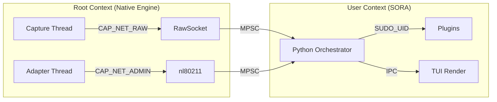

# Security Model and Memory Safety

The SORA project operates at a low level of the Linux networking stack, which requires special attention to privilege management and memory safety. This section documents the Threat Model and the audit of `unsafe` code.

## 1. Threat Model and Privileges

To work with `AF_PACKET` and `nl80211`, the process requires elevated privileges.

### Required Capabilities (Linux)
SORA requires the following kernel capabilities:
- **`CAP_NET_RAW`**: To open raw sockets and inject arbitrary frames.
- **`CAP_NET_ADMIN`**: To change interface parameters (Monitor Mode, Change Channel).

### Visualization: Privilege Map


### Initialization Stages:
1. **Phase 1 (Initialize)**: The process starts under `root` or with established capabilities.
2. **Phase 2 (Open FD)**: The Rust core opens all necessary file descriptors (raw sockets, netlink).
3. **Phase 3 (Spawn Plugins)**: Plugins are launched before privilege dropping to inherit necessary permissions.
4. **Phase 4 (Drop)**: Call to `drop_privileges` (transition to `SUDO_UID` context).
5. **Phase 5 (Verify)**: Verification via `getuid() != 0`.

## 2. Audit of `unsafe` Blocks (Safety Rationale)

The use of `unsafe` in the SORA Rust core is limited exclusively to `libc` calls and FFI, where safe wrappers cannot be used without performance loss or flexibility degradation.

### Module `engine/af_packet.rs`
- **`libc::if_nametoindex`**: Used to get the interface index. Safe as the input string is validated.
- **`libc::bind` / `libc::recv` / `libc::send`**: Direct calls to system functions. SORA guarantees that the passed buffers (`buf.as_mut_ptr()`) are of sufficient size and do not overlap.
- **`std::mem::zeroed`**: Used to initialize `sockaddr_ll`. Safe as the structure consists of primitive types and is correctly populated before use.

### Module `nl80211/neli_backend.rs`
- **`libc::ioctl`**: Used for `SIOCSIFFLAGS` (UP/DOWN).
  - *Rationale*: The `ifreq` structure is prepared via `ptr::copy_nonoverlapping`. We limit the copy to `IFNAMSIZ - 1` length to prevent stack buffer overflow.

## 3. High Integrity: Fuzzing & Malformed Frames

To ensure "Kernel-grade reliability," the 802.11 parsers in SORA have undergone aggressive fuzz testing.

### Methodology: `cargo-fuzz` (libFuzzer)
`libFuzzer` is used for testing, generating millions of random byte sequences for the `parse_frame()` function.

```rust
// core/fuzz/fuzz_targets/parse_ie.rs
fuzz_target!(|data: &[u8]| {
    let _ = sora_core::engine::parsers::parse_frame(data);
});
```

- **Zero-Panic Guarantee**: Thanks to Safe Rust, even when receiving malformed frames, the parser returns `ParsedFrame::Unknown` instead of a `segfault`.
- **Robustness**: We simulated vulnerabilities similar to those found in Broadcom drivers, confirming that SORA is resilient to "Denial of Service" attacks via the radio spectrum.

## 4. Privilege Separation

| Thread | Capabilities | Rationale |
| :--- | :--- | :--- |
| **Capture (Rust)** | `CAP_NET_RAW` | Required to read `sk_buff` from a RAW socket. |
| **Adapter (AAL)** | `CAP_NET_ADMIN` | Channel and power management via `nl80211`. |
| **Orchestrator** | **SUDO_UID** | Primary logic in Python. Isolated from the networking stack. |
| **UI / Plugins** | **User-level** | Complete isolation. Plugins only gain privileges if explicitly launched before the Drop Phase. |

:::tip
**Security Audit Note**: The primary protection vector is dropping privileges in `priv_drop.rs` via `libc::setuid`. Even if a vulnerability is found in the Python layer, an attacker will not gain kernel-level privileges.
:::
