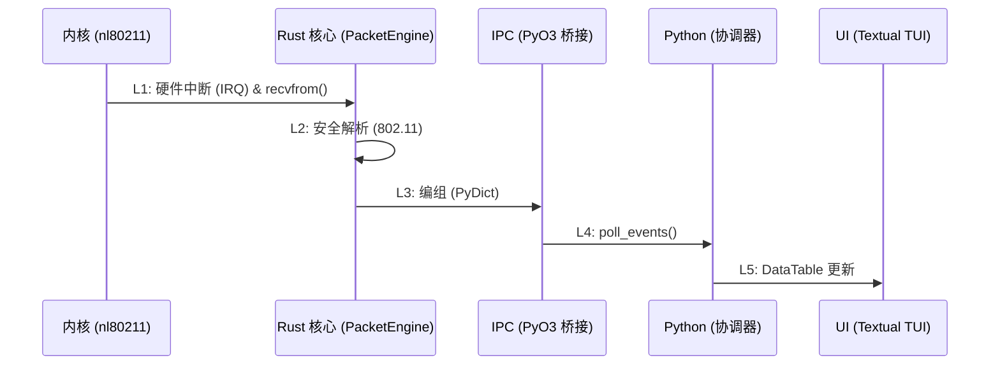

# 数据包生命周期：从天线到 TUI (Lifecycle of a Packet)

了解 SORA 中数据包的生命周期对于性能评估和确保数据完整性至关重要。本章节描述了一个 802.11 帧穿过系统所有层级的全过程。

## 1. 端到端追踪 (L1-L5)

### L1：内核与捕获 (Kernel ➔ Rust)
- **机制**：Wi-Fi 适配器驱动程序（如 `ath9k`）接收物理信号，将其转换为 `sk_buff` 并传递给 Linux 网络栈。
- **接口**：SORA 打开一个 `AF_PACKET` 类型的 `RAW` 套接字。`af_packet.rs` 中的 `libc::recvfrom` 调用将数据从内核缓冲区拷贝到 Rust 的用户空间。
- **延迟**：约 15–50 微秒 (µs)。

### L2：安全解析 (Internal Rust)
- **机制**：字节切片 `&[u8]` 被传递给 `parse_frame`。
- **安全性选择**：与基于 C 的驱动程序不同，SORA 使用 **Safe Rust** 来解析信息元素 (IE)。边界检查内置在语言中，消除了处理畸形 (malformed) 帧时的缓冲区溢出错误。
- **延迟**：约 2–8 微秒 (µs)。

### L3：跨越边界 (IPC Marshalling)
- **机制**：原生的 `SoraEvent` 结构体通过 PyO3 转换为 `PyDict`。
- **数据流**：数据被放入 `crossbeam-channel` (MPSC) 中。这一阶段需要获取微秒级的 **GIL** (全局解释器锁)。
- **延迟**：约 150–300 微秒 (µs)。

### L4：协调编排 (Python 逻辑)
- **机制**：异步应用程序的主循环调用 `event_receiver.poll_events()`。
- **处理**：`AttackController` 分析事件类型，更新 FSM 状态，并在必要时发起 SQLite 写入。

### L5：可视化 (TUI 渲染)
- **机制**：`DataTable` 小部件的 `update_cell` 方法修改 Textual 内存中的单元格状态。
- **同步**：异步渲染引擎在下一次事件循环迭代时将更改刷新到用户终端。
- **延迟**：约 5–30 毫秒 (ms)（取决于 TUI 轮询频率）。

## 2. 延迟瓶颈分析 (Latency Bottlenecks)

| 阶段 | 负载类型 | 风险 |
| :--- | :--- | :--- |
| **L1 ➔ L2** | CPU / 内核 | 在高 PPS 时，`rmem_max` 可能发生溢出。 |
| **L3 ➔ L4** | IPC / GIL | 在高负载计算或数据库写入期间，Python 锁导致的延迟。 |
| **L4 ➔ L5** | I/O / 终端 | 尝试同时渲染 1000 行以上数据时导致的终端卡顿。 |

:::info
**严格的技术说明**：SORA 架构的主要优势在于 **L1** 和 **L2** 在原生线程中运行，不受 Python 层暂停的影响。即使 UI 界面卡顿了 500 毫秒，数据包捕获和 PCAP 记录仍会无损地继续进行。
:::
