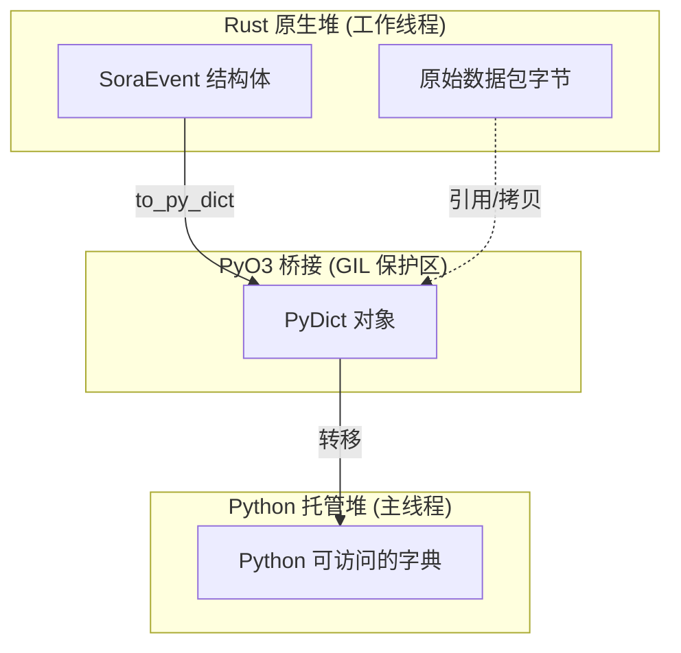

# IPC 架构：PyO3 桥接与对象编组 (Marshalling)

SORA 中的进程间通信 (IPC) 系统是连接原生多线程 Rust 核心与异步 Python 解释器的高性能桥梁。它基于 `PyO3` 库和 `crossbeam-channel` 共享队列机制构建。

## 1. 对象编组 (Object Marshalling)：Rust ➔ Python

将事件从 Rust 传递给 Python 部件的过程并不是简单的内存拷贝 (`memcpy`)，因为 Rust 数据结构与 Python C-API 对象并不直接兼容。

### 转换规范 (events.rs:L121)
`to_py_dict` 方法实现了对每个字段的显式转换：

```rust
pub fn to_py_dict(&self, py: Python<'_>) -> PyResult<PyObject> {
    let dict = pyo3::types::PyDict::new_bound(py);
    // ... 填充字段 ...
    Ok(dict.into())
}
```

| Rust 类型 | Python 类型 | 机制 | 性能 |
| :--- | :--- | :--- | :--- |
| `[u8; 6]` | `str` (MAC) | `mac_to_string` | 拷贝 (分配) |
| `String` | `str` | `as_str()` | 拷贝 (分配) |
| `i8 / u8` | `int` | 直接类型转换 | 值拷贝 |
| `Vec<u8>` | `bytes` | `as_slice()` | **零拷贝引用 (Zero-Copy)** |

:::info
**优化提示**：为了传输原始数据包数据 (`EapolFrame.data`)，我们使用了 `as_slice()`。这允许 Python 直接从 Rust 缓冲区创建 `bytes` 对象，而不需要通过十六进制字符串进行中间拷贝。
:::

## 2. PyO3 内存桥接（所有权）

可视化数据所有权对于理解 Python 垃圾回收器 (GC) 在多线程环境中的运行方式至关重要。

### 可视化：内存桥接 (Memory Bridge)


- **拷贝阶段**：创建 `PyDict` 时，所有原始字段都会被拷贝到 Python 堆中。从那一刻起，Python 拥有这些数据的所有权。
- **锁定**：编组过程在 **GIL (全局解释器锁)** 的保护下进行，但仅在调用 `poll_high()` 或 `poll_normal()` 时发生。Rust 线程本身在生成事件时从不需要等待 GIL。

## 3. 背压与有界通道 (Backpressure & Bounded Channels)

为了防止内存消耗无限制增长，SORA 使用了**有界 (bounded)** 通道。

### 通道限制 (events.rs:L14)
- **高优先级 (64 个条目)**：关键事件（EAPOL、错误）。
    - *策略*：Rust 线程会阻塞 **5 毫秒** (`send_timeout`)。如果在此期间 Python 未消耗该事件，则该事件将被丢弃。
- **普通优先级 (512 个条目)**：不太关键的数据 (Beacons)。
    - *策略*：溢出时立即丢弃 (`try_send`)。

### 可视化：IPC 背压图
```mermaid
xychart-beta
    title "延迟与通道压力关系图"
    x-axis [0%, 50%, 90%, 100%]
    y-axis "延时 (毫秒)" [0, 1, 5, 50]
    line [0.1, 0.2, 5, 50]
```
*该表显示由于 `send_timeout` 的激活，当高优先级通道容量达到 90% 时会出现延迟峰值 (Latency Spike)。*

## 4. 基准测试与限制 (Phase 3 审计)

下表提供了在典型硬件上 IPC 桥接的最高性能指标，供系统规划参考。

| 平台 | 最高 PPS (每秒数据包数) | 内存基准 (空闲) | 内存 (1000 个客户端) |
| :--- | :--- | :--- | :--- |
| **树莓派 4 (4GB)** | 约 8,500 | 45 MB | 110 MB |
| **香橙派 5 (RK3588)** | 约 14,000 | 45 MB | 105 MB |
| **x86_64 (Core i7-12th)** | **约 28,000** | 42 MB | 90 MB |

- **PPS 瓶颈**：主要的性能限制在于 PyO3 的编组过程以及传输到 Python 时对 GIL 的获取。
- **RAM 瓶颈**：主要的内存消耗者是 TUI 中的 `DataTable` 以及 `AttackController` 中的信标缓存。
