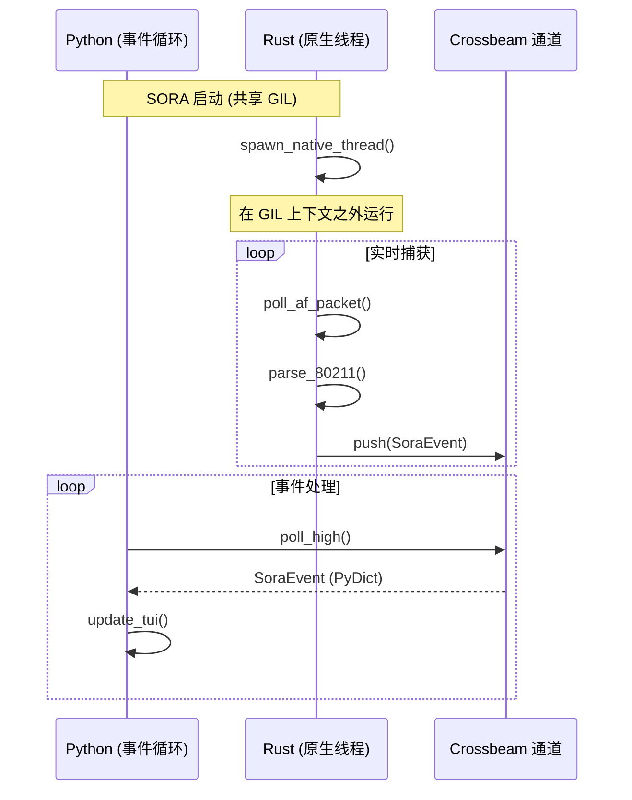
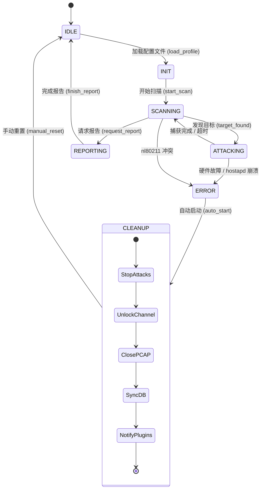

# AttackController 与 GIL 逃逸 (GIL Escape)

本章节记录了 SORA 的高级控制逻辑，以及用于绕过 Python 全局解释器锁 (GIL) 限制的架构方案。

## 1. “GIL 逃逸” (The GIL Escape) 架构

在 Python 中开发高性能工具的主要挑战之一是 GIL，它阻止了 Python 字节码在多个系统线程中并行执行。SORA 通过将所有“重型”工作移交给原生 Rust 核心 (Rust Core) 来解决这个问题。

### 可视化：GIL 逃逸 (GIL Escape)

### 可视化：状态机 (扩展版)

### 职责分离：
- **Python (协调器)**：处理状态逻辑、TUI 更新、SQLite 写入以及插件管理。在 `asyncio` 事件循环内的一个单线程中运行。
- **Rust (工作者)**：处理数据包捕获、实时 802.11 解析以及数据包注入。在通过 PyO3 创建的**独立原生系统线程** (`std::thread`) 中运行。

### 交互机制：
Rust 线程 `sora-packet-engine` 完全独立于 Python 解释器。它向 MPSC 通道 (Crossbeam) 写入事件。Python 层调用 `poll()` 方法，该方法仅检查队列中是否存在就绪对象。这使得 SORA 能够以 Rust 端每秒处理数千个数据包的速度运行，同时保持 Python 接口的响应能力。

:::tip
**性能说明**：得益于这种架构，Python 进程的 CPU 负载极低（约 2-5%），而 Rust 线程可以 100% 地利用核心进行捕获任务且不阻塞用户界面。
:::

## 2. AsyncIO 任务管理

`AttackController` 与 `asyncio` 集成，用于管理后台操作。

### 事件生命周期 (fsm.py:L51)
`process_event` 方法由主 `run_tui` 循环调用。
1. **轮询 (Polling)**：`asyncio` 定期检查 `rx.poll_high()`。
2. **调度 (Dispatch)**：如果找到事件，则将其传递给 `AttackController`。
3. **状态变更 (State Change)**：如果事件是关键的（例如，握手完成），协调器会调用 `_transition()`。

### 优雅清理 (Graceful Cleanup) (fsm.py:L159)
当切换到 `ERROR` 状态或结束会话时，控制器将启动清理协议。这确保了系统不会处于不稳定状态。
- **超时**：清理时间严格限制在 **3.0 秒**以内。
- **顺序**：
    1. 停止 Rust 中的数据包生成。
    2. 释放硬件锁定 (Channel Unlock)。
    3. 同步并关闭 PCAP 文件。
    4. 将状态持久化至 MetadataDB 数据库。
    5. 通过插件总线通知外部插件。

## 3. 状态与转换表

| 状态 | 描述 | 允许的转换 |
| :--- | :--- | :--- |
| **IDLE** | 等待用户命令 | `SCANNING` |
| **SCANNING** | 正在寻找目标网络并收集 Beacon | `ATTACKING`, `REPORTING`, `ERROR` |
| **ATTACKING** | 正在执行主动/被动攻击 | `SCANNING`, `REPORTING`, `ERROR` |
| **REPORTING** | 最终报告生成 | `IDLE` |
| **ERROR** | 关键错误（硬件/驱动程序） | `IDLE` (重置后) |

## 4. 容错能力 (Fault Tolerance)

SORA 的设计旨在防止系统出现“挂死”状态。

### 处理 `hostapd` 崩溃
如果由 `ConfigManager` 启动的 `hostapd` 进程意外退出：
1. 插件/管理器通过 PID 文件或 `SIGCHLD` 检测到终止情况。
2. `adapter_error` 事件被发送到 IPC 总线。
3. `AttackController` 立即调用 `enter_error("hostapd_failure")`。
4. 启动 **CLEANUP**，保证释放接口。

### 处理 IPC 队列溢出
如果 Python 层出现延迟（如高负载的 SQLite 解析）且 `crossbeam` 队列溢出：
- **Rust 端**：丢弃旧的 `BeaconFrame` 事件，但将 `EapolFrame` 在 5ms 缓冲区内保留。
- **Python 端**：TUI 上的 `StatusPanel` 显示 `IPC drops`（IPC 丢包）增长，提醒操作员需要优化磁盘子系统负载。

:::danger
**严格的技术说明**：切换至 `ERROR` 状态时，清理时间严格限制在 **3.0 秒**以内。如果由于某种原因清理未能完成，SORA 将执行强制退出 (`sys.exit`)，依靠 Linux 内核对已打开的 PCAP 文件和原始套接字的自动清理机制。
:::
