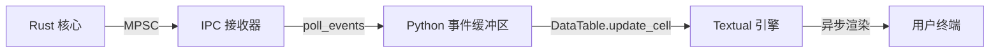

# TUI 内部机制：Textual 与事件循环优化

SORA 的用户界面建立在 `Textual` 框架 (Async TUI) 之上。该层的主要任务是在不阻塞主渲染循环的情况下，可视化来自 Rust 核心的高速事件流。

## 1. Textual 事件循环与轮询 (Polling)

由于 Rust 核心运行在原生系统线程中，Python 层必须定期请求新数据。为此，使用了 `set_interval` 定时器。

### 轮询机制 (app.py:L83)
```python
# 50 毫秒间隔 (对应网络更新的 20 FPS)
self.set_interval(0.05, self.poll_events)
```

每隔 50 毫秒会调用一次 `poll_events` 方法，执行对 IPC 通道的“排空” (Draining) 操作：
1. **常规队列 (Beacons)**：读取所有累积的访问点信标。
2. **高优先级队列 (EAPOL)**：读取关键的握手捕获事件。
3. **内部日志**：将字符串日志输出到右侧面板。

## 2. DataTable 优化

`DataTable` 小部件用于显示数百个访问点。在无线电活动频繁的情况下，标准的行插入操作可能会导致界面卡顿。

### O(1) 更新策略 (app.py:L58)
SORA 使用哈希映射 `self.networks` (BSSID ➔ RowKey) 来缓存对表格行的引用。

```python
if bssid not in self.networks:
    # 每个 BSSID 在会话开始时仅进行一次 O(1) 操作
    row_key = table.add_row(bssid, ssid, ch, rssi, "")
    self.networks[bssid] = row_key
else:
    # 立即更新单元格，无需重新绘制整个表格
    table.update_cell(self.networks[bssid], "RSSI", rssi)
```

**优势：**
- **增量式更新**：如果 10 个 AP 的信号强度 (RSSI) 同时发生变化，仅需重绘特定的单元格。
- **内存效率**：我们不在 UI 层存储帧数据的副本，仅存储对行键的引用。

## 3. 可视化：TUI 渲染流水线 (TUI Rendering Pipeline)



## 4. 处理 IPC 丢包 (Backpressure)

状态栏（底部）显示 `IPC drops`（IPC 丢包）计数器 (app.py:L143)。
- **来源**：Rust 核心统计未能放入 `ArrayQueue`（4096 条记录）的数据包数量。
- **诊断**：如果在 TUI 以 20 FPS 轮询时该计数器仍在增长，则意味着 Python 层无法跟上处理传入流量的速度（例如由于 SQLite 写入缓慢）。

:::warning
**严格的技术说明**：如果丢包率超过每秒 1000 个，TUI 可能会暂时“冻结” Beacon 表的更新，以优先处理 EAPOL 握手事件。
:::
