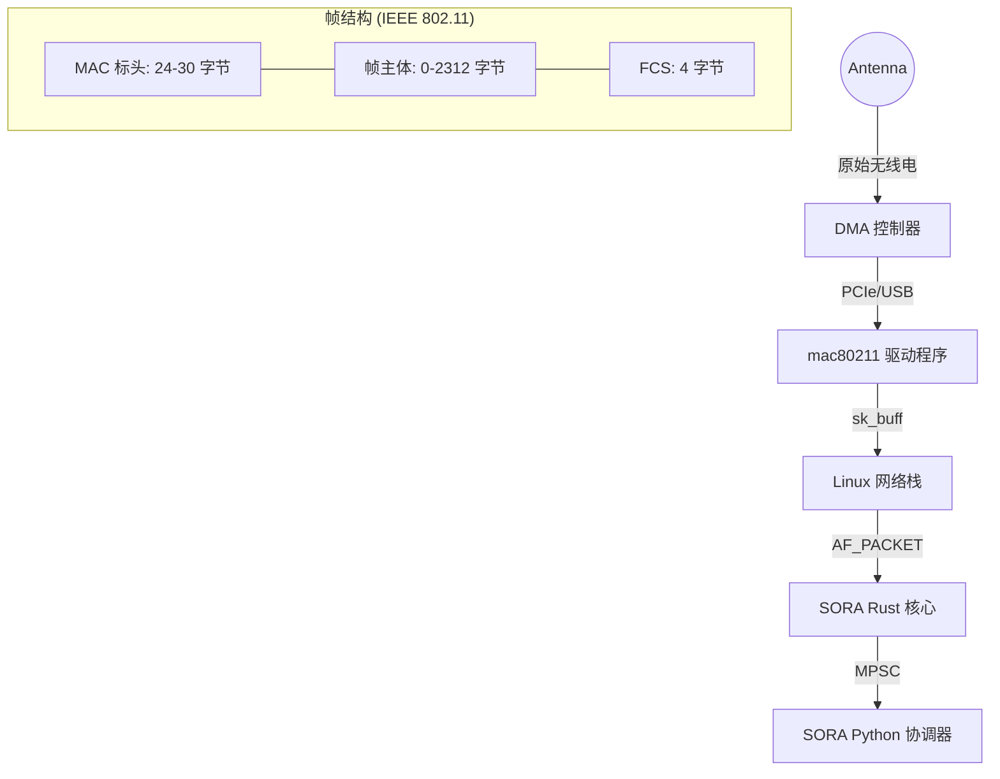

# PacketEngine 与 AF_PACKET 深入解析

本章节介绍了 SORA 中数据包捕获和注入的底层实现。该架构专注于低延迟，并通过 `AF_PACKET` 套接字家族与 Linux 内核网络栈进行直接交互。

## 1. 零拷贝理念 (Zero-Copy Philosophy)

在 SORA 中，最大限度地减少地址空间之间的数据复制是首要任务。

### 可视化：硬件路径与帧结构 (Hardware Path & Frame Anatomy)


### 数据传输机制：
1. **内核 ➔ 驱动程序**：数据包进入网卡的环形缓冲区 (Ring Buffer)。
2. **驱动程序 ➔ PacketEngine**：`libc::recv` 调用将数据从内核缓冲区复制到预先分配的栈缓冲区 `buf: [u8; 4096]`（参见 `packet_engine.rs:L76`）。
3. **PacketEngine ➔ 解析器 (Parser)**：解析在同一缓冲区的切片 (Slice) 上执行，无需堆分配。
4. **解析器 ➔ SoraEvent**：如果帧是相关的（例如 EAPOL），则创建一个 `SoraEvent`。`data: Vec<u8>` 字段是唯一发生堆分配的地方，用于将数据所有权转移到 Python 层。

:::info
在 Phase 4 中，计划引入 `PACKET_RX_RING` (mmap)，这将完全消除 `recv` 复制，并允许直接从内核与 SORA 之间的共享内存中读取数据包。
:::

## 2. AF_PACKET：底层实现

SORA 通过 `libc` 接口与网络栈交互。使用 `AF_PACKET` 可以绕过 L3/L4 协议层。

### 套接字初始化 (af_packet.rs:L30)

`RawSocket::new` 函数执行以下步骤：

1. **创建描述符**：
   ```rust
   libc::socket(AF_PACKET, SOCK_RAW, ETH_P_ALL.to_be())
   ```
   `ETH_P_ALL` 标志指示内核向我们传递**所有**以太网帧（如果接口处于监听模式，则包括 Radiotap 标头）。

2. **接口映射**：
   `libc::if_nametoindex` 调用将名称（例如 `wlan0mon`）转换为内核所需的整数索引 `ifindex`。

3. **绑定 (Binding)**：
   使用 `libc::sockaddr_ll`（链路层地址）结构。
   ```rust
   struct sockaddr_ll {
       sll_family:   u16,     // AF_PACKET
       sll_protocol: u16,     // ETH_P_ALL
       sll_ifindex:  i32,     // 接口索引
       sll_hatype:   u16,     // 标头类型 (ARPHRD_IEEE80211)
       sll_pkttype:  u8,      // 数据包类型 (PACKET_OTHERHOST)
       sll_halen:    u8,      // 地址长度
       sll_addr:     [u8; 8], // 物理地址
   };
   ```
   SORA 填充 `sll_ifindex` 和 `sll_protocol`，并调用 `libc::bind`。这保证了套接字仅绑定到目标适配器。

## 3. 802.11 解析规范 (IEEE 802.11-2020)

`parsers.rs` 中的解析依赖于标准的固定偏移量。SORA 假设存在 Radiotap 标头（通常为 24-36 字节，动态确定）。

### MAC 标头偏移量（从 802.11 帧开始）

| 偏移量 (字节) | 长度 | 字段 | 标准 | 描述 |
| :--- | :--- | :--- | :--- | :--- |
| **0** | 2 | **帧控制 (Frame Control)** | §9.2.4.1 | 帧类型、子类型和标志 |
| **2** | 2 | **Duration/ID** | §9.2.4.2 | 介质占用时间 |
| **4** | 6 | **地址 1** | §9.2.4.3 | RA (接收者地址) |
| **10** | 6 | **地址 2** | §9.2.4.3 | TA (传输者地址) |
| **16** | 6 | **地址 3** | §9.2.4.3 | BSSID |
| **22** | 2 | **序列控制 (Sequence Control)** | §9.2.4.4 | 分段号和序列号 |

### 帧控制字段拆解 (16 位)

```text
Bits:  0-1    2-3      4-7    8    9    10   11   12   13   14   15
Field: Ver  Type    Subtype  ToDS FrDS More Frag Retry Pwr  More Prot Order
```

**SORA 逻辑：**
- `Type == 00` (管理) + `Subtype == 1000` (Beacon) ➔ `ParsedFrame::Beacon`。
- `Type == 10` (数据) + `Subtype == 0000` (数据) + 存在 LLC/SNAP ➔ EAPOL 检查 (类型 0x888E)。

## 4. 数据包注入 (TX Path)

`RawSocket::send` 调用（参见 `af_packet.rs:L85`）是 `libc::send` 系统调用的直接包装。
1. 数据包不经过路由表。
2. 数据包不被内核分段。
3. 驱动程序自动添加 FCS (帧校验序列)，除非通过 `IEEE80211_TX_CTL_NO_FCS` 另有说明。

:::info
注入操作是同步的。为了维持 Phase 4 (Karma) 的时序，使用了带优先级的 `crossbeam` 通道，以便 `TxDispatch` 线程不会阻塞 `PacketEngine` 逻辑。
:::
