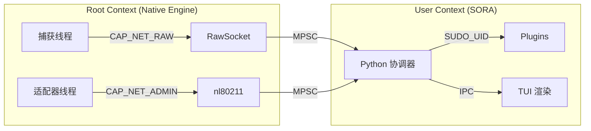

# 安全模型与内存安全 (Security Model)

SORA 项目运行在 Linux 网络栈的底层，这需要特别关注权限管理和内存安全。本章节详细说明了威胁模型 (Threat Model) 以及对 `unsafe` 代码的审计。

## 1. 威胁模型与权限

为了操作 `AF_PACKET` 和 `nl80211`，进程需要获得扩展权限。

### 所需权能 (Linux Capabilities)
SORA 需要以下内核权能：
- **`CAP_NET_RAW`**：用于打开原始套接字并注入任意帧。
- **`CAP_NET_ADMIN`**：用于更改接口参数（监听模式、切换信道）。

### 可视化：权限图谱 (Privilege Map)


### 初始化阶段：
1. **阶段 1 (初始化)**：进程以 `root` 身份或预设的权能启动。
2. **阶段 2 (打开 FD)**：Rust 核心打开所有必要的文件描述符（原始套接字、netlink）。
3. **阶段 3 (启动插件)**：在丢弃权限之前启动插件，以便继承必要的授权。
4. **阶段 4 (丢弃权限)**：调用 `drop_privileges`（切换到 `SUDO_UID` 上下文）。
5. **阶段 5 (验证)**：通过 `getuid() != 0` 进行验证。

## 2. `unsafe` 代码块审计 (Safety Rationale)

SORA Rust 核心对 `unsafe` 的使用仅限于 `libc` 调用和 FFI。在这些场景中，如果不使用底层接口就无法在保持性能或灵活性。

### `engine/af_packet.rs` 模块
- **`libc::if_nametoindex`**：用于获取接口索引。输入字符串经过有效性验证，是安全的。
- **`libc::bind` / `libc::recv` / `libc::send`**：直接调用系统函数。SORA 保证传输缓冲区 (`buf.as_mut_ptr()`) 的大小足够且不发生重叠。
- **`std::mem::zeroed`**：用于初始化 `sockaddr_ll`。该结构体由原始类型组成，并在使用前已正确填充，是安全的。

### `nl80211/neli_backend.rs` 模块
- **`libc::ioctl`**：用于 `SIOCSIFFLAGS` (UP/DOWN)。
  - *原理说明*：`ifreq` 结构体通过 `ptr::copy_nonoverlapping` 准备。我们将拷贝长度限制在 `IFNAMSIZ - 1` 以内，以防止栈缓冲区溢出。

## 3. 高完整性：模糊测试与畸形帧 (Fuzzing)

为了确保“内核级可靠性”，SORA 的 802.11 解析器经过了高强度的模糊测试。

### 方法论：`cargo-fuzz` (libFuzzer)
我们使用 `libFuzzer` 为 `parse_frame()` 函数生成数百万个随机字节序列进行测试。

```rust
// core/fuzz/fuzz_targets/parse_ie.rs
fuzz_target!(|data: &[u8]| {
    let _ = sora_core::engine::parsers::parse_frame(data);
});
```

- **零崩溃保证 (Zero-Panic Guarantee)**：得益于 Safe Rust，即使收到精心构造的畸形 (malformed) 帧，解析器也会返回 `ParsedFrame::Unknown` 而非引发 `segfault` 段错误。
- **鲁棒性**：我们模拟了类似于博通 (Broadcom) 驱动程序中发现的漏洞，确认了 SORA 对通过无线电进行的“拒绝服务”攻击具有免疫力。

## 4. 权限隔离 (Privilege Separation)

| 线程 (Thread) | 权能 (Capabilities) | 理由 |
| :--- | :--- | :--- |
| **Capture (Rust)** | `CAP_NET_RAW` | 从 RAW 套接字读取 `sk_buff` 所必需。 |
| **Adapter (AAL)** | `CAP_NET_ADMIN` | 通过 `nl80211` 管理信道和功率。 |
| **Orchestrator** | **SUDO_UID** | Python 层的主要逻辑。与网络栈隔离。 |
| **UI / Plugins** | **User-level** | 完全隔离。插件仅在降权阶段前显式启动时才获得权限。 |

:::tip
**安全审计说明**：主要防御向量是 `priv_drop.rs` 中通过 `libc::setuid` 丢弃权限。即使 Python 层被发现漏洞，攻击者也无法获得内核级权限。
:::
